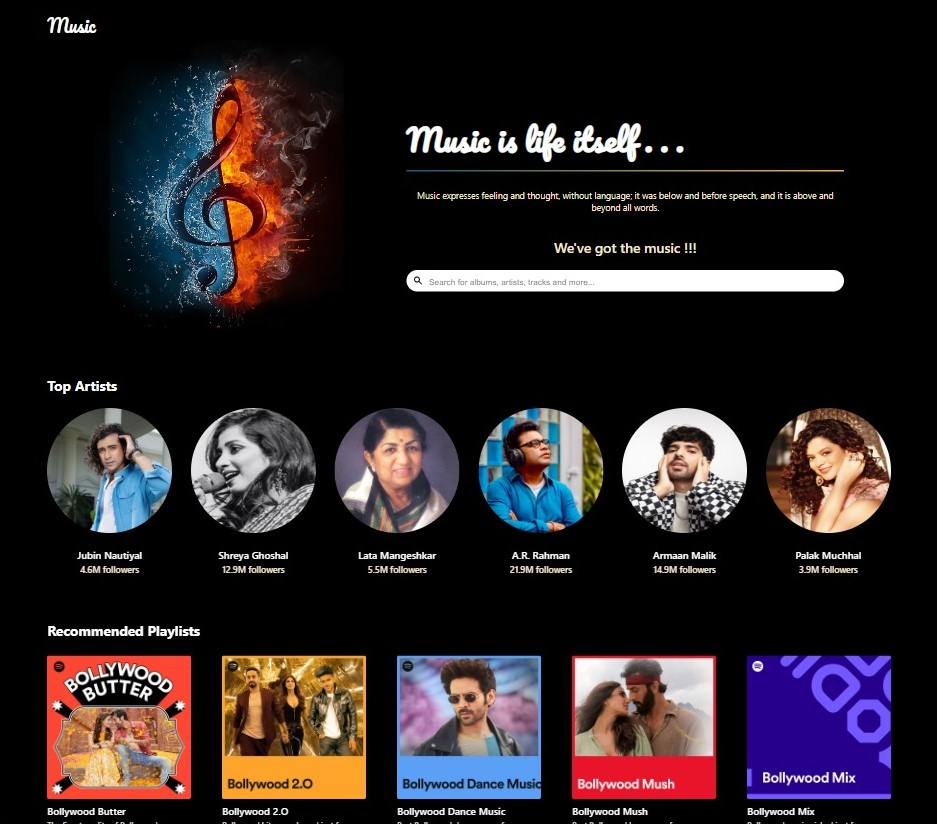
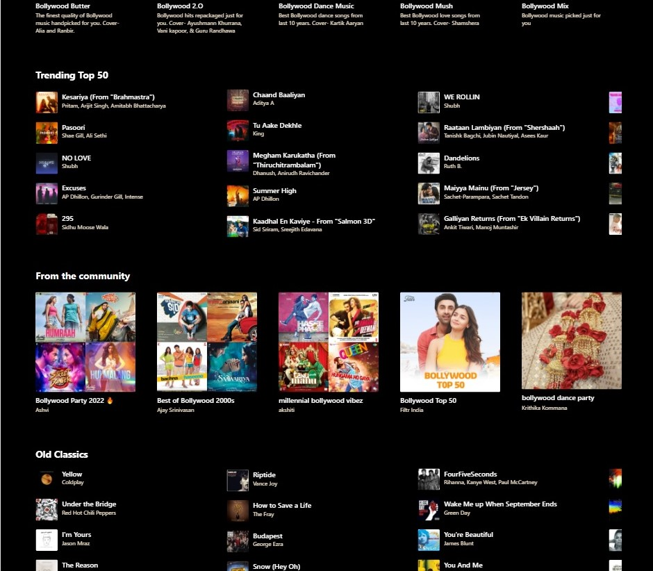
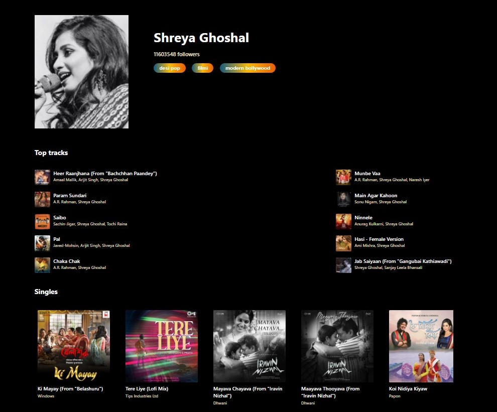
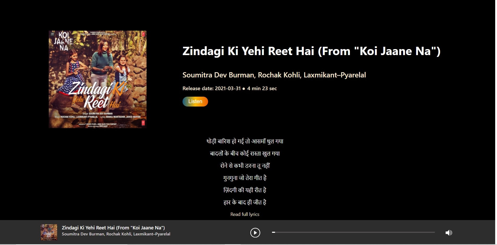
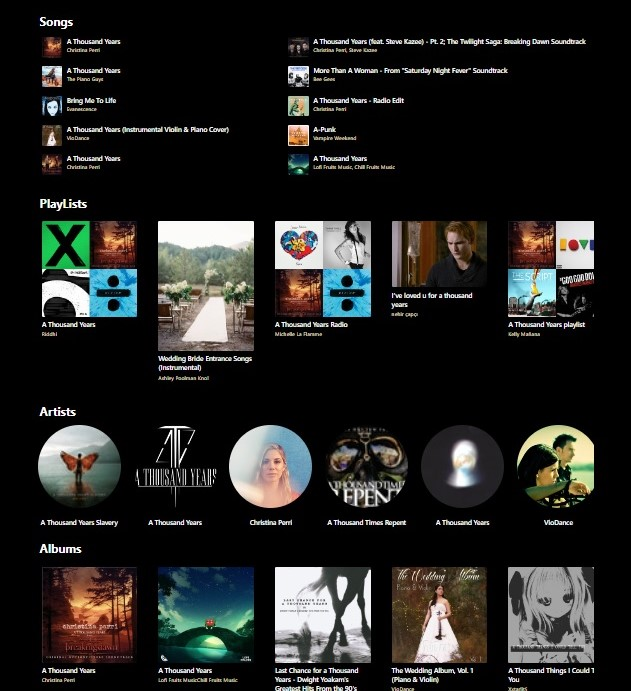

## Music App

This app allows users to:

- search for tracks, playlists and albums
- search for artists and get details about their number of followers, their top tracks and singles
- get a list of trending songs, playlist recommendations and playlists from the community
- have a look at the track details, lyrics and listen to its preview
- view the optimal layout for the site depending on their device's screen size

### Screenshots

### Demo

.gif>)

### Built with

- HTML
- CSS
- [React](https://reactjs.org/) - JS library

### API used

- Spotify by Glavier (Rapid API): [https://rapidapi.com/Glavier/api/spotify23/](https://rapidapi.com/Glavier/api/spotify23/)
